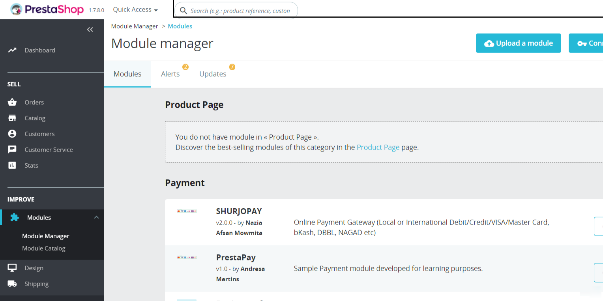
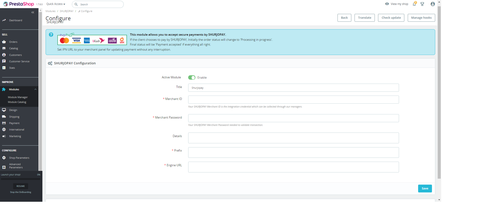
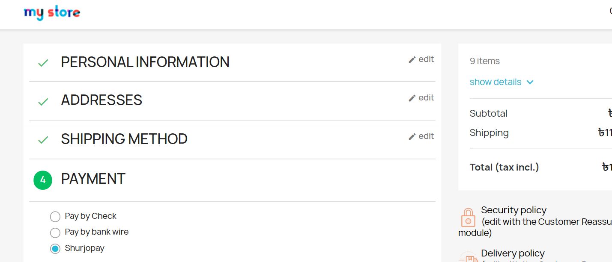

# shurjoPay - Prestashop

shurjoPay-Online Payment Gateway for Bangladesh. 

### Feature

  - Web API
  - Webhook

### Installation Steps:

Please follow these steps to install the shurjoPay Payment Gateway module.

- Step 1: First Download the File from smukhidev/prestashop.
- Step 2: Unzip `prestashop.zip`.
- Step 3: Only Zip SHURJOPAY folder.
- Step 4: Upload SHURJOPAY file to Prestashop admin panel.
- Step 5: Follow the navigation `IMPROVE >> Modules >> Module Manager >> SHURJOPAY` (Search for SHURJOPAY).
- Step 6: After successful installation go to SHURJOPAY Configure.
- Step 7: Set module Title, this will show to checkout page. 
- Step 8: Set your valid Merchant ID, Merchant Password and Prefix and engine url provided from shurjoPay (Mandatory). 
- Step 9: You can set additional information to Details.

### Image Reference:

* Follow Step 5

* Follow Step 6

* Show In Checkout Page(Step 9)

---------------------------------------------------------------------------------

- Author : Nazia Afsan Mowmita
- Team Email: shurjopay@shurjomukhi.com.bd (For any query)
- More info: https://www.shurjopay.com.bd

© 2021 shurjoPay ALL RIGHTS RESERVED
